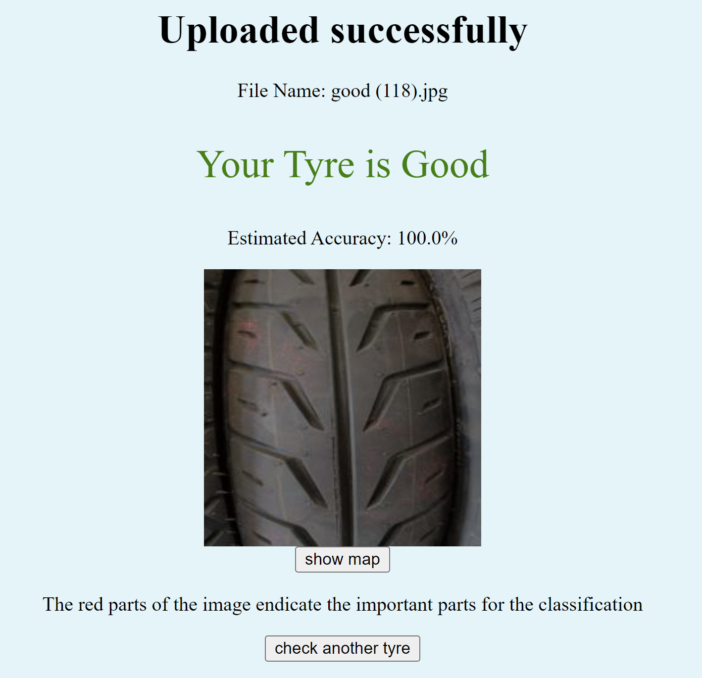

# Tire-Quality-Check



## Overview

This repository contains code and resources for a tire quality classification project. The goal of the project is to develop a machine learning model that can classify tires into different quality categories (good, defective) based on visual features.

## Features

- Tire image classification into quality categories.
- MobileNetV3-based model for image classification.
- saliency map generation for visualizing important image regions.

## Table of Contents

- [Installation](#installation)
- [Usage](#usage)
- [Contributing](#contributing)
- [License](#license)

## Installation

1. Clone the repository:

   ```bash
   git clone https://github.com/AmirShib/Tire-Quality-Check.git 
   ```
   
2. Install the required dependencies:

	```bash
		
	pip install -r requirements.txt
	```

## Usage 

1. run the web application 
	```bash
	python app.py
	```
	
2. upload the image to be classified 

## Contributing
Contributions are welcome! If you find any issues or want to enhance the project, feel free to open an issue or submit a pull request.

## License
This project is licensed under the **MIT License**. 
